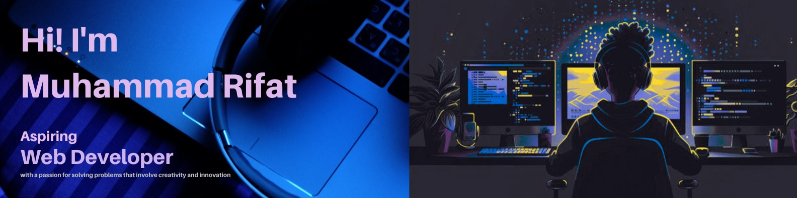

<!-- Banner -->

# 👋 Hi, I'm Rifat Alam  
### 💻 Full Stack Web Developer | MERN Stack Enthusiast

---

## 🧑‍💻 About Me

I'm a passionate Full Stack Developer from Bangladesh 🇧🇩.  
I love building responsive web apps with a great user experience and clean code.

- 🌱 I’m currently exploring **Next.js**
- 🚀 I’m working on a **Home Repair Service Web App**
- 💬 I’m also improving my **Data Structures & Algorithms**
- ✍️ I regularly write code and practice on **GitHub**

---

## 🛠️ Skills & Technologies

  
  
  
  
  
  
  
  
  
  

---

## 🌐 Connect with Me

  
  
  

---

## 📊 GitHub Stats

  
  

---

## 📌 Pinned Projects

### 🧰 Home Repair Service App  
`MERN stack app for booking and managing home repair services`

**Live:** [https://homerepair.example.com](https://homerepair.example.com)  
**Tech Stack:** React, Node.js, Express, MongoDB, Firebase Auth  

---

### 🗺️ Tourism Website  
`Responsive tourism website for booking and exploring destinations`

**Live:** [https://tourism-app.example.com](https://tourism-app.example.com)  
**Tech Stack:** React, Tailwind CSS, React Router

---

### 📚 Task Manager  
`A simple task management app with CRUD features and filters`

**Live:** [https://task-manager.example.com](https://task-manager.example.com)  
**Tech Stack:** React, Express.js, MongoDB, JWT

---

🔚 **Thanks for visiting my profile!** 😊  
